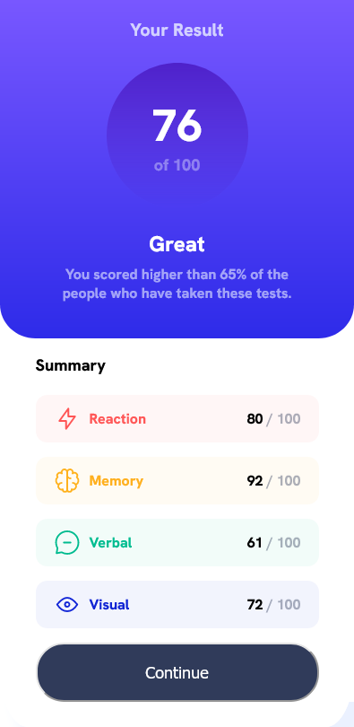

# Frontend Mentor - Results summary component solution

This is a solution to the [Results summary component challenge on Frontend Mentor](https://www.frontendmentor.io/challenges/results-summary-component-CE_K6s0maV). Frontend Mentor challenges help you improve your coding skills by building realistic projects. 

## Table of contents

- [Overview](#overview)
  - [The challenge](#the-challenge)
  - [Screenshot](#screenshot)
  - [Links](#links)
- [My process](#my-process)
  - [Built with](#built-with)
  - [What I learned](#what-i-learned)
  - [Continued development](#continued-development)
  - [Useful resources](#useful-resources)
- [Author](#author)
- [Acknowledgments](#acknowledgments)

## Overview

### The challenge

Users should be able to:

- View the optimal layout for the interface depending on their device's screen size
- See hover and focus states for all interactive elements on the page

### Screenshot

Desktop Preview

Mobile Preview

### Links

- Live url: [live url here](https://exhibition-2.vercel.app/)

## My process

### Built with

- Semantic HTML5 markup
- CSS custom properties
- Flexbox

### What I learned

Well i built it from scratch purely using just html and css and my favorite editor Visual Studio Code. I tried my best..not perfect but still learning haha.I have been able to learn more about the various screen sizes and how to make them more responsive using media queries.

### Continued development

I will make it more interactive in very soon XD.

### Useful resources

- [Developer Mozilla1](https://developer.mozilla.org/en-US/) - Comes in handy when looking up synthax.

## Author

- Frontend Mentor - [@sycero](https://www.frontendmentor.io/profile/sycero)

**Note: Delete this note and add/remove/edit lines above based on what links you'd like to share.**

## Acknowledgments

I will like to give a huge thanks and shoutout to GOD almighty for helping me through out this project. 2nd Corinthians 3:5 "not that we are competent in ourselves to claim anything for ourselves but our competence comes from God"
